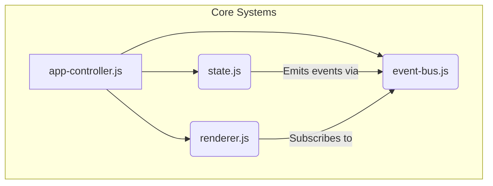
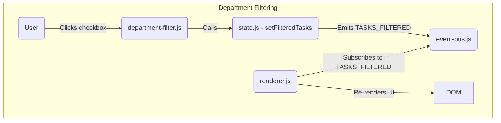
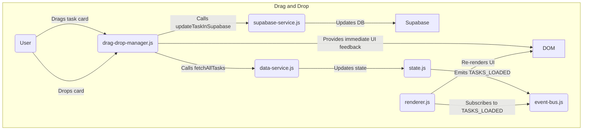

# Application Architecture: Semantic Map

This document provides a detailed overview of the project's architecture, outlining the purpose and responsibility of each directory within the `src` folder, as well as the core architectural patterns and data flow.

## High-Level Overview

The application is architected in a modular, feature-oriented fashion. The entry point is `src/main.js`, which initializes core services and starts the main application controller. The architecture is designed to be scalable and maintainable by separating concerns into distinct layers:

-   **Core:** Central application logic, state management, and orchestration.
-   **Services:** Communication with external APIs and data sources.
-   **Components:** Reusable UI elements that make up the user interface.
-   **Features:** Self-contained modules for specific application functionalities (e.g., printing, drag-and-drop).
-   **Config:** Centralized configuration and constants.
-   **Renderers:** Specialized logic for rendering complex UI parts.
-   **Utils:** Shared helper functions.
-   **Styles:** Global and component-specific CSS.

---

## Architectural Patterns and Data Flow

The application employs several key architectural patterns to ensure a robust and maintainable codebase:

1.  **Centralized State Management:** All application state is managed within `core/state.js`. This provides a single source of truth, making data flow predictable and easier to debug. No other module should hold its own state.

2.  **Publish/Subscribe (Pub/Sub) Model:** The `core/event-bus.js` implements a pub/sub system. When the state is updated in `state.js`, it emits an event. Other modules (like UI components or the renderer) subscribe to these events and react accordingly. This decouples modules, allowing them to communicate without direct dependencies.

3.  **Orchestration Layer:** The `core/app-controller.js` acts as the main orchestrator. It manages the application's lifecycle, including a detailed 6-phase initialization process that brings services, UI components, and features online in a controlled sequence.

### Data Flow Example: Updating a Task

Here is a typical data flow when a user updates a task:

1.  A **UI Component** (e.g., a task card) captures a user interaction (e.g., a click).
2.  The component calls a method in a **Service** (e.g., `data-service.js`) to perform the update.
3.  The **Service** makes an API call to the backend (e.g., Supabase) to save the change.
4.  Upon a successful response, the service updates the central state by calling a setter function in **`core/state.js`**.
5.  **`state.js`** updates the relevant data and emits a `TASKS_UPDATED` event via the **`core/event-bus.js`**.
6.  The **`core/renderer.js`** is subscribed to this event. It receives the updated data and re-renders the affected parts of the schedule grid.

This unidirectional data flow ensures that the UI is always a reflection of the application state.

---

## Module Interaction Analysis

This section provides a granular, file-by-file breakdown of key modules and their interactions, visualized with Mermaid.js diagrams.

### Core Systems Interaction

This diagram shows the relationship between the core architectural components. The `app-controller` initializes all systems. The `state` manager is the single source of truth, and the `event-bus` facilitates communication.

### Feature: Department Filtering

This diagram illustrates the flow when a user interacts with the department filter.

### Feature: Drag and Drop Task

This diagram shows the more complex interaction for the drag-and-drop feature.

---

## Directory Breakdown

### 📂 `src/`

The root directory for all application source code.

#### 📄 `main.js`

The main entry point of the application. Its primary responsibilities are:
-   Importing and initializing core modules like the error handler and application controller.
-   Setting up backward compatibility for legacy code.
-   Kicking off the application startup sequence.

### 📂 `core/`

The heart of the application. This directory contains the central logic that orchestrates the entire application lifecycle.
-   **`app-controller.js`**: Manages the main application flow, including a 6-phase initialization. It coordinates between services, components, and features.
-   **`state.js`**: The single source of truth for all application data. All state modifications and reads go through this module. Emits events on state change.
-   **`event-bus.js`**: A publish/subscribe system for cross-component communication. This decouples modules and enables a reactive architecture.
-   **`renderer.js`**: The core rendering engine. It listens for state change events and efficiently updates the DOM.
-   **`storage.js`**: Handles interactions with `localStorage` for persisting state across sessions (e.g., scroll position, current week).

### 📂 `services/`

Handles all external communication and data fetching. This layer abstracts the data sources from the rest of the application.
-   **`data-service.js`**: The primary service for fetching, caching, and processing application data before it is passed to the state manager.
-   **`sheets-service.js`**: Logic for interacting with Google Sheets API.
-   **`supabase-service.js`**: Logic for interacting with the Supabase backend for real-time updates and manual task management.
-   **`auth-service.js`**: Handles user authentication and authorization.

### 📂 `components/`

Contains all the reusable UI components that form the visual interface of the application. These components are generally "dumb" and receive their data from the state manager.
-   **`schedule-grid.js`**: The main grid view for the schedule.
-   **`task-card.js`**: The component for displaying a single task. It dispatches actions but does not manage its own state.
-   **`week-navigation.js`**: UI for navigating between weeks.
-   **`modals/`**: A subdirectory containing various modal dialog components (e.g., `add-task-modal.js`, `project-modal.js`).

### 📂 `features/`

Contains self-contained modules that encapsulate a specific piece of application functionality. This is a form of feature-slicing.
-   **`drag-drop/`**: All logic related to drag-and-drop functionality for tasks. It interacts with the `data-service` to persist changes.
-   **`editing/`**: Handlers and UI for adding, deleting, and editing tasks.
-   **`print/`**: Logic for generating and rendering the print-friendly view of the schedule.
-   **`context-menu/`**: Custom right-click context menu functionality.

### 📂 `renderers/`

Contains specialized rendering functions that are more complex than a typical component. These are often used by the core rendering engine.
-   **`card-renderer.js`**: Handles the specific logic for rendering task cards, including all their states and variations.

### 📂 `config/`

A centralized location for all application configuration, constants, and settings. This makes it easy to manage and update application behavior without changing code logic.
-   **`api-config.js`**: URLs and keys for external APIs.
-   **`constants.js`**: General application-wide constants.
-   **`department-config.js`**: Configuration related to business departments.

### 📂 `utils/`

A collection of utility and helper functions that are used across multiple parts of the application.
-   **`date-utils.js`**: Functions for date manipulation and formatting.
-   **`logger.js`**: The application's logging utility.
-   **`ui-utils.js`**: Helper functions for DOM manipulation and UI calculations.

### 📂 `styles/`

Contains all the CSS files for styling the application.
-   **`base.css`**: Base styles, resets, and variables.
-   **`layout.css`**: Styles for the main application layout.
-   **`task-card.css`**: Styles specific to the task card component.
-   **`print.css`**: Styles for the print view.

---

## Module Dependencies

This section details the dependencies and dependents for each key module in the application.

**Dependencies** are the modules that a given file imports and relies on to function.
**Dependents** are the modules that import and use the given file.

### 📄 `src/main.js`

-   **Dependencies:**
    -   `core/app-controller.js`: To start the application.
    -   `core/error-handler.js`: To initialize global error handling.
    -   `utils/logger.js`: For logging application startup.
-   **Dependents:**
    -   None (Application entry point).

### 📂 `core/`

#### `app-controller.js`
-   **Dependencies:** Manages the entire application, so it depends on almost every core module, service, and major component to initialize them. Key dependencies include `state.js`, `event-bus.js`, `data-service.js`, and various UI component initializers.
-   **Dependents:** `main.js`.

#### `state.js`
-   **Dependencies:** `event-bus.js` (to emit events), `logger.js`.
-   **Dependents:** Used widely across the application by any module that needs to read or write application data. This includes `renderer.js`, all services, and most UI components.

#### `event-bus.js`
-   **Dependencies:** `logger.js`.
-   **Dependents:** Used by `state.js` to publish events and by many UI components and the `renderer.js` to subscribe to those events.

#### `renderer.js`
-   **Dependencies:** `state.js`, `storage.js`, `week-renderer.js`, `date-utils.js`, `grid-layout-manager.js`, `ui-utils.js`, `event-bus.js`.
-   **Dependents:** `drag-drop-manager.js`, `component-events.js`.

#### `storage.js`
-   **Dependencies:** `logger.js`.
-   **Dependents:** `renderer.js`, `week-navigation.js`, `schedule-grid.js`, `department-filter.js`.

### 📂 `services/`

#### `data-service.js`
-   **Dependencies:** `sheets-service.js`, `supabase-service.js`, `date-utils.js`, `ui-utils.js`, `state.js`.
-   **Dependents:** `app-controller.js`, `drag-drop-manager.js`, `delete-task-handler.js`, `add-task-modal.js`.

#### `sheets-service.js`
-   **Dependencies:** `auth-service.js`, `api-config.js`, `ui-utils.js`.
-   **Dependents:** `data-service.js`, `project-modal.js`.

#### `supabase-service.js`
-   **Dependencies:** `api-config.js`, `ui-utils.js`, `timing-constants.js`, `layout-constants.js`.
-   **Dependents:** `data-service.js`, `task-card-editor.js`, `drag-drop-manager.js`, `delete-task-handler.js`, `add-task-modal.js`.

#### `auth-service.js`
-   **Dependencies:** `api-config.js`, `timing-constants.js`.
-   **Dependents:** `sheets-service.js`.

### 📂 `components/`

#### `schedule-grid.js`
-   **Dependencies:** `state.js`, `event-bus.js`, `storage.js`, `date-utils.js`, `week-renderer.js`.
-   **Dependents:** `week-navigation.js`.

#### `task-card.js`
-   **Dependencies:** `state.js`.
-   **Dependents:** `week-renderer.js`, `smart-renderer.js`.

#### `week-navigation.js`
-   **Dependencies:** `state.js`, `event-bus.js`, `storage.js`, `date-utils.js`, `schedule-grid.js`.
-   **Dependents:** `initialization-orchestrator.js`.

### 📂 `features/`

#### `drag-drop/drag-drop-manager.js`
-   **Dependencies:** `state.js`, `supabase-service.js`, `data-service.js`, `renderer.js`, `department-filter.js`.
-   **Dependents:** Initialized by the `app-controller.js`.

### 📂 `utils/`

#### `logger.js`
-   **Dependencies:** None.
-   **Dependents:** Used by nearly every module in the application for logging.

#### `date-utils.js`
-   **Dependencies:** `timing-constants.js`.
-   **Dependents:** Used by many modules for date calculations, including `data-service.js`, `renderer.js`, `schedule-grid.js`, etc.